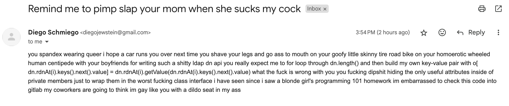

# Project Decomissioned

This project has been decomissioned. I, James Sumners, took it on when it was
languishing without any maintenance as it filled a need in the ecosystem and
I had built things at a prior organization that depended upon this project.
I spent a lot of time triaging issues and reworking things toward a path
that could be more easily maintained by a community of volunteers. But I have
not had the time to dedicate to this project in quite a while. There are
outstanding issues that would take me at least a week of dedicated development
time to solve, and I cannot afford to take time off of work to do that.
Particularly considering that the aforementioned organization was two
jobs ago, and it is extremely unlikely that I will transition to a role again
that will need this project.

So, why am I just now deciding to decomission this project? Because today,
2024-05-14, I received the following email:

I will not tolerate abuse, and I especially will not tolerate tacit death
threats, over a hobby. You can thank the author of that email for the
decomissioning on this project.

My recommendation to you in regard to LDAP operations: write a gateway in a
language that is more suited to these types of operations. I'd suggest
[Go](https://go.dev).

👋

P.S.: if I ever do need this project again, I might revive it. But I'd fight
hard for my suggestion above. Also, I will consider turning it over to an
interested party, but I will require at least one recommendation from a
Node.js core contributor that I can vet with the people that I know on that
team.